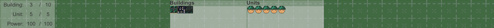
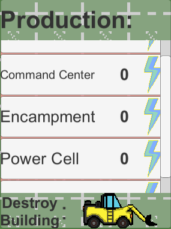
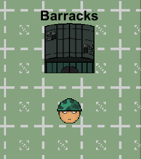

# Mid Core Strategy Game
 
This project is a prototype that consists of base building and unit controlling aspects of a 4X Game developed in 2 weeks.

4X is an abbreviation for Explore, Expand, Exploit and Exterminate.

## Gameplay Overview

## Controls
- Buildings
  - Left Click to Interact with buildings and UI elements
  - Right Click to Cancel certain orders
- Units
  - Left Click to Interact with units and UI elements
  - Right Click to set Unit Paths
- Escape button to Pause

## Design
- Units pathfinding is handled with an A* Pathfinding Algorithm.

- Project was made with OOP principles whenever they were required

- Various design patterns such as:
  - Singleton
  - Factory 
  - Publish and Subscribe 
  - SOLID 

were implemented in the making of the game.
- Units and Buildings use Interfaces and Abstract classes.

## Interface
- UI Consists of 3 Elements
  - Game Board
  - Production Panel
  - Information Panel
  
  
#### Game Board

An area where the produced buildings and soldiers displayed

#### Production Panel

An infinite scroll view that contains a list of buildings that can
be produced with an Bulldozer icon on the bottom that enables you to delete misplaced buildings

#### Information Panel

The information area, that belongs to the selected units.
(building/soldier). That also enables you to produce units from certain buildings

